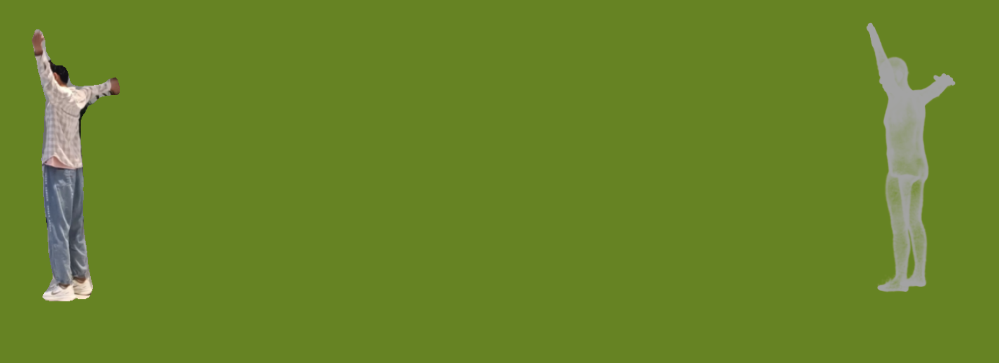

### It seems to be working fine
picture show that it can custom data for ml-hugs



But there still seem to be some issues that need to be addressed....

### Introduce my code

*make_densepose* and *dp_00000.png.npy* are used to generate the contents of the densepose folder. (I don't know what was densed, but the contents are the same anyway) </br>
*drawpoint.py* is used to visualise the 2d joints generated by 4D-humans (check that your 2d joints are correct) </br>
*export_alignment_myself.py* my own modified alignment file </br>
*image_conversion.py*  for processing segmentations and getting the jpg images needed by 4D-human </br>
The code in the other folders comes from ml-neuman. </br>


### How to use

The usage is similar to that preprocessing process of neuman. </br>

```bash
conda activate preprocessForHugs
python gen_run.py --video path/to/video.mp4
```
then you can find *run.sh* </br>
We recommend to read the comments of gen_run.py before executing it. </br>
It can be executed piece by piece. </br>

### Configuration environment

The steps are mostly referenced from [ml-neuman's dockerfile](https://github.com/apple/ml-neuman/tree/main/preprocess "ml-neuman的dockerfile")


First,The folder structure is as follows:</br>
Theoretically, the folder could be structured differently, but you'd need to change the paths in *gen_run.py*
```
root-|-4D-Humans
     |-detectron2
     |-preprocessForHugs
     |-ROMP
```

### Installation of dependencies
```bash
apt-get update && apt-get install -y \
    git \
    cmake \
    vim \
    wget \
    unzip \
    build-essential \
    libboost-program-options-dev \
    libboost-filesystem-dev \
    libboost-graph-dev \
    libboost-system-dev \
    libboost-test-dev \
    libeigen3-dev \
    libsuitesparse-dev \
    libfreeimage-dev \
    libgoogle-glog-dev \
    libgflags-dev \
    libglew-dev \
    qtbase5-dev \
    libqt5opengl5-dev \
    libcgal-dev \
    libcgal-qt5-dev
```

### Build and install ceres solver

```bash
apt-get -y install \
libatlas-base-dev \
libsuitesparse-dev
git clone https://github.com/ceres-solver/ceres-solver.git --branch 1.14.0 #基本上所有的git都需要中国大陆用户自行添加代理
cd ceres-solver
mkdir build
cd build
cmake .. -DBUILD_TESTING=OFF -DBUILD_EXAMPLES=OFF \  
make -j12 # Modify to suit your equipment j4 -> j24
make install
```

### Build and install COLMAP
Note: This Dockerfile has been tested using COLMAP pre-release 3.6. Later versions of COLMAP (which will be automatically cloned as default) may have problems using the environment described thus far. If you encounter
problems and want to install the tested release, then uncomment the branch specification in the line below
```bash
git clone https://github.com/colmap/colmap.git #--branch 3.6
cd colmap
git checkout 96d4ba0b55c0d1f98c8c432420ecd6540868c398 
mkdir build
cd build
#ubuntu22安装colmap可能出现的问题以及解决方法：https://github.com/colmap/colmap/issues/1626
cmake .. -DCUDA_NVCC_FLAGS="--std c++14"
make -j24 
make install
```

### ROMP & detectron2
The paths to ROMP and detecron can be changed, just install them both in the conda virtual environment ROMP. If you change the path, the path in gen_run.py also needs to be changed.
```bash
cd /ROMP
git clone --recurse-submodules https://github.com/jiangwei221/ROMP.git
git checkout f1aaf0c1d90435bbeabe39cf04b15e12906c6111

git clone --recurse-submodules https://github.com/jiangwei221/detectron2.git
cd detectron2
git checkout 2048058b6790869e5add8832db2c90c556c24a3e
```
### install ROMP and detectron2
Please note that pytorch can be installed depending on your ubuntu and graphics card version.  </br>
Here is the environment for configuring ROMP and detectron2, referenced from neuman's issue (you can also refer to the issue if you have problems with this part of the installation) 
```bash
cd ROMP
conda create -n ROMP python==3.8.8 && \
conda activate ROMP && \
# I'm actually cuda11.8 and installed it here with 11.3 too
conda install -c pytorch pytorch=1.11 torchvision torchaudio cudatoolkit=11.3 && \ 
conda install -c fvcore -c iopath -c conda-forge fvcore iopath && \
conda install -c bottler nvidiacub && \
onda install pytorch3d -c pytorch3d

conda activate ROMP && \
cd /preprocessForHugs/ROMP && \
pip install -r requirements.txt && \
pip install av

python -m pip install -e detectron2 && \
pip install setuptools==59.5.0
```

### preprocessForHugs
```bash
conda create -n preprocessForHugs python=3.10 -y && \
conda activate preprocessForHugs && \
pip install torch==2.0.1 torchvision==0.15.2 torchaudio==2.0.2 --index-url https://download.pytorch.org/whl/cu118 # 根据你的设备修改
conda install -c conda-forge igl && \
pip install opencv-python joblib open3d imageio tensorboardX chumpy lpips scikit-image ipython matplotlib
```


### install 4d-humans
use *preprocessForHugs/demo.py* replace *4D-Humans/demo.py*
```bash
git clone https://github.com/shubham-goel/4D-Humans.git
cd 4D-Humans
conda create --name 4D-humans python=3.10
conda activate 4D-humans
pip install torch #不一定是cu12，根据自己硬件装
pip install -e .[all]
pip install git+https://github.com/brjathu/PHALP.git #安装phalp
#可能会有pyrender问题：pyrender报错ImportError: (‘Unable to load EGL library‘, ‘EGL: cannot open shared object file:
#如何解决：https://blog.csdn.net/jiaoooooo/article/details/133500112
```
